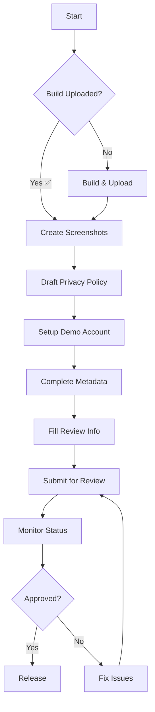

# App Store Submission Documentation

**Purpose**: Central hub for all App Store submission documentation
**App**: Nam Việt Internal (ID: 6754835683)
**Last Updated**: November 6, 2025

---

## 🚨 Current Status

**Build Status**: ✅ Production build uploaded to App Store Connect
**Submission Status**: ⏳ Preparing for submission

### Blocking Issues
1. ❌ **Screenshots** - 0 uploaded (iPhone 6.5" required)
2. ✅ **Privacy Policy URL** - Implemented at `/privacy-policy` (PSN-15, PR #10)
3. ❌ **Privacy Questionnaire** - Not started
4. ❌ **Demo Account** - Not configured
5. ❌ **Pricing & Availability** - Not set
6. ❌ **Age Rating** - Not completed

**Estimated Time to Complete**: 8-10 hours

---

## 📁 Documentation Structure

### Core Documents

| Document | Purpose | Status |
|----------|---------|--------|
| **[Current Status](./app-store-current-status.md)** | Live tracking of submission progress | 🔴 Critical - Check daily |
| **[Submission Checklist](./app-store-submission-checklist.md)** | Complete 400+ line reference guide | ✅ Complete |
| **[Task Tracker](../tasks/20251106-094500-app-store-submission-preparation.md)** | Implementation tracking | ⏳ In Progress |

### Templates & Guides

| Document | Purpose | Ready to Use |
|----------|---------|--------------|
| **[Privacy Policy Template](./app-store-privacy-policy-template.md)** | Bilingual privacy policy (VN/EN) | ✅ Yes |
| **[App Review Notes](./app-store-review-notes-template.md)** | Information for Apple reviewers | ✅ Yes |
| **[Demo Account Guide](./app-store-demo-account-guide.md)** | Setup test account for review | ✅ Yes |
| **[Screenshot Guide](./app-store-screenshot-guide.md)** | Detailed screenshot creation process | ✅ Yes |

### Related Documentation

| Document | Location | Purpose |
|----------|----------|---------|
| **EAS Build Workflow** | `.claude/tasks/20251104-035119-implement-eas-build-submit-workflow.md` | CI/CD setup |
| **App Version Tracking** | `.claude/tasks/20251106-085928-app-version-tracking-ota-updates.md` | OTA updates |

---

## 🎯 Quick Action Guide

### Today's Priority Tasks

1. **Create Screenshots** (2 hours)
   - See [Screenshot Guide](./app-store-screenshot-guide.md)
   - Minimum 3, recommend 5-8
   - Use iPhone 14 Pro Max simulator

2. **Draft Privacy Policy** (2 hours)
   - Use [Privacy Policy Template](./app-store-privacy-policy-template.md)
   - Translate company-specific details
   - Host on company website

3. **Setup Demo Account** (1 hour)
   - Follow [Demo Account Guide](./app-store-demo-account-guide.md)
   - Create account: `apple.review@namviet.test`
   - Populate with sample data

4. **Complete App Store Connect** (1 hour)
   - Fill all metadata fields
   - Upload screenshots
   - Add privacy URL
   - Complete questionnaires

---

## 📋 Submission Workflow



---

## 🔗 Quick Links

### App Store Connect
- **App Page**: https://appstoreconnect.apple.com/apps/6754835683
- **Version 1.0**: https://appstoreconnect.apple.com/apps/6754835683/distribution/ios/version/inflight
- **Privacy Section**: https://appstoreconnect.apple.com/apps/6754835683/distribution/privacy
- **TestFlight**: https://appstoreconnect.apple.com/teams/6d14b01a-6353-49a9-b9c6-26a057fab119/apps/6754835683/testflight

### Development
- **Apple Developer**: https://developer.apple.com/
- **Review Guidelines**: https://developer.apple.com/app-store/review/guidelines/
- **HIG**: https://developer.apple.com/design/human-interface-guidelines/

### Project
- **Bundle ID**: `vn.dienlanhnamviet.internal`
- **Team ID**: `9F77J83SKT`
- **Apple ID**: `dustin.do95@gmail.com`

---

## ✅ Pre-Submission Checklist

### Screenshots
- [ ] iPhone 6.5" screenshots (min 1, max 10)
- [ ] iPad screenshots (if supporting iPad)
- [ ] Vietnamese UI visible
- [ ] Real data (no lorem ipsum)
- [ ] First 3 screenshots are best

### Privacy
- [ ] Privacy Policy drafted
- [ ] Privacy Policy hosted and accessible
- [ ] Privacy URL added to App Store Connect
- [ ] Privacy Questionnaire completed
- [ ] Data types properly disclosed

### Demo Account
- [ ] Account created in Clerk
- [ ] Sample tasks added
- [ ] GPS bypass enabled for demo
- [ ] Photos attached to tasks
- [ ] Login tested successfully

### Metadata
- [ ] App description accurate
- [ ] Keywords optimized
- [ ] Support URL working
- [ ] Contact info filled
- [ ] Age rating completed
- [ ] Pricing set (Free)
- [ ] Territories selected

### Review Info
- [ ] Demo credentials provided
- [ ] Review notes clear
- [ ] Contact person designated
- [ ] Response plan ready

---

## 🚀 Commands

### Check Build Status
```bash
cd apps/mobile
eas build:list --platform ios
```

### Submit Build (if needed)
```bash
cd apps/mobile
eas submit --platform ios --profile production
```

### Generate Screenshots (Simulator)
```bash
# Set perfect status bar
xcrun simctl status_bar booted override --time "9:41" --batteryLevel 100

# Take screenshot
xcrun simctl io booted screenshot screenshot.png
```

---

## 📞 Support Contacts

### Technical
- **Primary**: Dương Đỗ (dustin.do95@gmail.com)
- **Phone**: +84-979477635

### Company
- **Company**: CÔNG TY TNHH THƯƠNG MẠI VÀ ĐIỆN LẠNH NAM VIỆT
- **Website**: https://dienlanhnamviet.vn
- **Address**: 698 Truong Chinh, Tan Binh, Ho Chi Minh City

### Apple
- **Developer Support**: https://developer.apple.com/contact/
- **App Review**: https://developer.apple.com/contact/app-store/

---

## 🔄 Post-Submission

### Expected Timeline
- **Initial Review**: 24-48 hours typically
- **First Submission**: May take longer (up to 7 days)
- **Rejections**: Address within 14 days

### Common Rejection Reasons
1. Missing or broken demo account
2. Inaccurate screenshots
3. Privacy policy issues
4. Incomplete metadata
5. App crashes or bugs

### If Rejected
1. Read rejection reason carefully
2. Fix all mentioned issues
3. Test thoroughly
4. Resubmit with clear notes
5. Respond to review team promptly

---

## 📈 Progress Tracking

| Task | Status | Time Est. | Owner |
|------|--------|-----------|-------|
| Production Build | ✅ Complete | - | - |
| Screenshots | ⏳ Pending | 2 hours | TBD |
| Privacy Policy | ⏳ Pending | 2 hours | TBD |
| Demo Account | ⏳ Pending | 1 hour | TBD |
| Metadata | ⏳ Pending | 30 min | TBD |
| Privacy Quest. | ⏳ Pending | 30 min | TBD |
| Age Rating | ⏳ Pending | 10 min | TBD |
| Submit | ⏳ Pending | 10 min | TBD |

**Target Submission Date**: November 7, 2025

---

## 📚 Resources

### Internal Docs
- [Task Documentation](../../.claude/tasks/)
- [V1 Plans](../../.claude/plans/v1/)
- [Architecture Patterns](../../docs/architecture/patterns/)

### External Guides
- [App Store Review Guidelines](https://developer.apple.com/app-store/review/guidelines/)
- [App Store Connect Help](https://help.apple.com/app-store-connect/)
- [Expo EAS Submit](https://docs.expo.dev/submit/ios/)

---

## 🎉 Success Criteria

The submission is successful when:
1. App status shows "Waiting for Review"
2. All metadata is complete
3. Demo account works perfectly
4. Team is ready to respond to feedback
5. Backup plan exists for rejections

---

**Remember**: First impressions matter. Take time to ensure everything is perfect before submission. It's better to delay a day than to be rejected and wait another week.

---

*This document is the single source of truth for App Store submission. Keep it updated as progress is made.*