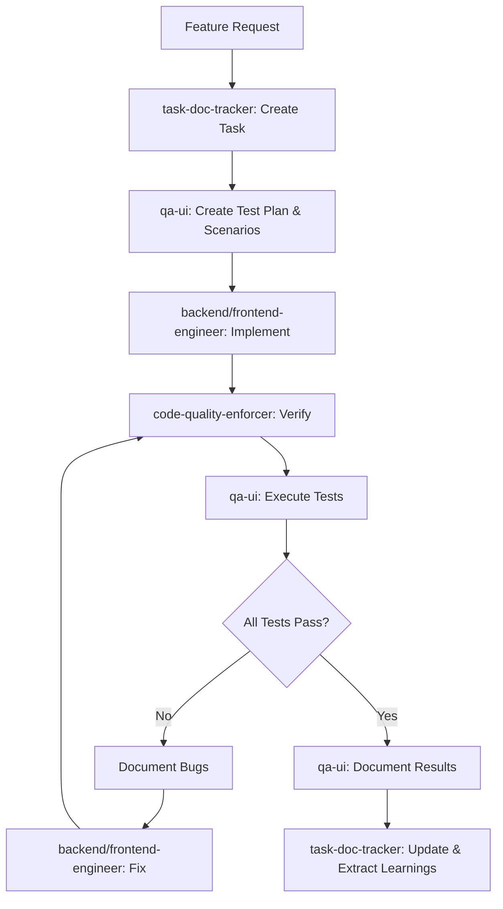
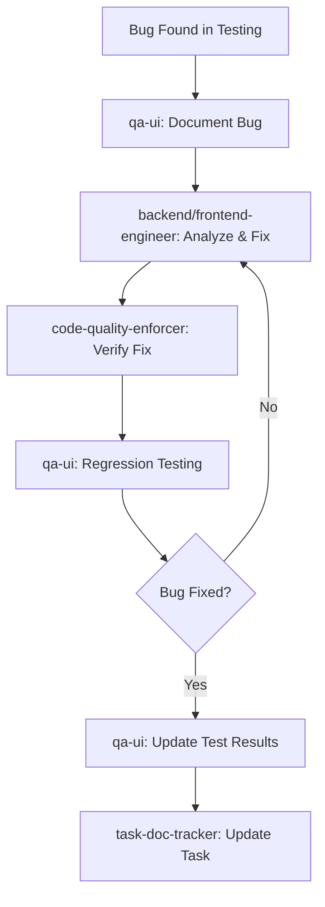

# QA Documentation Implementation Guide

This guide explains how to implement the QA documentation standards for the NV Internal mobile app.

## Overview

The QA documentation system provides a comprehensive framework for:
- Planning tests before implementation
- Executing tests systematically
- Documenting results and bugs
- Tracking quality metrics
- Integrating with development workflow

## Quick Start

### For Developers

When implementing a new feature:

1. **Before coding**: Ask `qa-ui` agent to create test plan
   - Review test scenarios for acceptance criteria
   - Understand edge cases that need handling
   - Reference element IDs and testID values

2. **During coding**: Ensure accessibility props are added
   - All buttons/inputs need `testID`, `accessibilityLabel`, `accessibilityHint`
   - Follow naming convention: `{screen}-{component}-{action}`
   - Example: `task-details-check-in-button`

3. **After coding**: Ask `qa-ui` agent to execute tests
   - Review test results
   - Fix any bugs found
   - Run regression tests

### For QA Testing

When testing a feature:

1. **Locate test documentation**:
   - Test plan: `.claude/qa/test-plans/YYYYMMDD-HHMMSS-feature-test-plan.md`
   - Test scenarios: `.claude/qa/test-scenarios/YYYYMMDD-HHMMSS-feature-test-scenarios.md`

2. **Set up test environment**:
   - Connect to device/simulator
   - Ensure test accounts ready
   - Verify app version

3. **Execute tests systematically**:
   - Follow test scenarios step by step
   - Use Mobile-MCP tools for interaction
   - Take screenshots for evidence
   - Document all observations

4. **Document results**:
   - Create test results file: `.claude/qa/test-results/YYYYMMDD-HHMMSS-feature-test-results.md`
   - Include pass/fail status, bugs, screenshots
   - Classify bugs by severity
   - Provide recommendations

5. **Track in task documentation**:
   - Update `.claude/tasks/` with testing status
   - Link test results to implementation task

## Directory Structure

```
.claude/qa/
├── README.md                    # Overview and workflow integration
├── test-plans/                  # Feature test plans
│   ├── README.md               # Test plan template and guide
│   └── YYYYMMDD-HHMMSS-feature-test-plan.md
├── test-scenarios/              # Detailed test cases
│   ├── README.md               # Test scenario template and guide
│   └── YYYYMMDD-HHMMSS-feature-test-scenarios.md
└── test-results/                # Test execution results
    ├── README.md               # Test results template and guide
    └── YYYYMMDD-HHMMSS-feature-test-results.md
```

## Naming Conventions

**Always use UTC timestamp format for descending sort**:
- Format: `YYYYMMDD-HHMMSS-descriptive-name.md`
- Example: `20251030-120000-payment-collection-test-plan.md`
- Why: Latest tests appear first when sorted

## Test Documentation Templates

### Test Plan Template

See `.claude/qa/test-plans/README.md` for complete template.

**Key sections**:
1. Overview (description, scope, objectives)
2. Test Environment (prerequisites, devices, tools)
3. Test Strategy (approach, risk areas)
4. Test Scenarios (high-level list)
5. Test Data (accounts, datasets)
6. Success Criteria
7. Dependencies
8. Schedule
9. Exit Criteria
10. Related Documentation

### Test Scenario Template

See `.claude/qa/test-scenarios/README.md` for complete template.

**Key sections**:
1. Test Scenario Matrix (overview table)
2. Test Cases (detailed for each test ID)
   - Priority, category, platform
   - Description
   - Preconditions
   - Test steps (numbered with expected results)
   - Postconditions
   - Mobile-MCP implementation
   - Edge cases
   - Notes

### Test Results Template

See `.claude/qa/test-results/README.md` for complete template.

**Key sections**:
1. Test Environment (device, OS, app version)
2. Test Summary (pass/fail statistics)
3. Test Execution Results (per test case)
4. Bugs Found (detailed bug reports)
5. Performance Observations
6. Accessibility Observations
7. Recommendations
8. Sign-off
9. Retest Plan

## Mobile-MCP Testing Pattern

Always follow this pattern for reliable testing:

```typescript
// 1. List available devices
const devices = mobile_list_available_devices();

// 2. Take screenshot to see current state
mobile_take_screenshot(device: "device_id");

// 3. List elements before clicking
const elements = mobile_list_elements_on_screen(device: "device_id");

// 4. Find target element by testID or label
// Example: "task-action-check-in-button" or "Bắt đầu làm việc"

// 5. Click using coordinates from element list
mobile_click_on_screen_at_coordinates(device: "device_id", x: X, y: Y);

// 6. Wait for async operations (GPS, uploads, API calls)
// Wait 2-3s for GPS, 1-2s for navigation, 3-5s for uploads

// 7. Type text when needed
mobile_type_keys(device: "device_id", text: "input text", submit: false);

// 8. Verify results with screenshots
mobile_take_screenshot(device: "device_id");

// 9. List elements to verify state changes
mobile_list_elements_on_screen(device: "device_id");
```

## Element Targeting Strategy

**Priority order**:
1. **testID prop** (most reliable)
   - Example: `task-action-check-in-button`
   - Unique across the app
   - Not visible to users

2. **accessibilityLabel** (semantic)
   - Example: "Bắt đầu làm việc"
   - User-facing Vietnamese text
   - Good for verification

3. **Coordinates** (last resort)
   - Get from `list_elements_on_screen()`
   - Less reliable (layout changes)
   - Always list elements first

## testID Naming Convention

Format: `{screen}-{component}-{action}`

**Examples**:
- `sign-in-username-input`
- `sign-in-password-input`
- `sign-in-submit-button`
- `task-list-item-{taskId}`
- `task-details-check-in-button`
- `task-details-check-out-button`
- `check-in-camera-button`
- `check-in-notes-input`
- `check-in-submit-button`

See `/apps/mobile/MOBILE-MCP-TESTING.md` for complete element reference.

## Test Priority Classification

| Priority | Description | When to Test |
|----------|-------------|--------------|
| Critical | Core functionality, blocks workflows | Test first, must pass |
| High | Important features, UX impact | Test second, should pass |
| Medium | Secondary features, edge cases | Test third, nice to pass |
| Low | Rare scenarios, trivial issues | Test when time permits |

## Bug Severity Classification

| Severity | Description | Priority | Timeline |
|----------|-------------|----------|----------|
| Critical | App crash, data loss, blocked workflow | P0 | Fix immediately (24h) |
| Major | Feature broken, workaround exists | P1 | Fix in current sprint |
| Minor | Edge case, low impact | P2 | Fix in next sprint |
| Trivial | Cosmetic, typo | P3 | Fix when time permits |

## Workflow Integration

### Feature Implementation Flow



### Bug Fix Flow



## Vietnamese Language Considerations

All UI text is in Vietnamese:
- Use exact Vietnamese strings in test documentation
- Test special characters (ă, â, ê, ô, ơ, ư, đ)
- Verify diacritics display correctly
- Validate tone marks render properly

**Common Vietnamese test strings**:
- "Tên đăng nhập" (Username)
- "Mật khẩu" (Password)
- "Đăng nhập" (Sign in)
- "Bắt đầu làm việc" (Start work)
- "Hoàn thành công việc" (Complete work)
- "Xác nhận bắt đầu" (Confirm start)
- "Xác nhận hoàn thành" (Confirm complete)
- "Không thể xác định vị trí" (Cannot determine location)
- "Chụp ảnh từ camera" (Take photo from camera)
- "Ghi chú" (Notes)

## Platform-Specific Testing

Test on both iOS and Android:

| Aspect | iOS | Android | Notes |
|--------|-----|---------|-------|
| Permissions | Settings-based | Runtime dialogs | Different UX |
| Navigation | Swipe from left | Back button | Different gestures |
| GPS | Xcode location | Emulator override | Different setup |
| Camera | Simulator limited | Emulator limited | Need real device |
| Performance | Generally faster | Varies by device | Test multiple devices |

## Performance Benchmarks

Target metrics:
- **Screen load**: <2 seconds
- **Navigation**: <500ms
- **GPS acquisition**: <3 seconds (first fix may take longer)
- **Photo upload**: <3 seconds (depends on network)
- **API calls**: <2 seconds
- **Scroll performance**: 60fps

Document actual vs target in test results.

## Accessibility Requirements

All interactive elements must have:
- ✅ `testID` prop (unique identifier)
- ✅ `accessibilityLabel` (Vietnamese label)
- ✅ `accessibilityHint` (what happens when activated)
- ✅ Minimum 44x44pt touch target
- ✅ Sufficient color contrast (WCAG AA)

See `/docs/testing/mobile-mcp.md` for implementation patterns.

## Common Testing Scenarios

### Authentication Testing
- Valid login (admin/worker)
- Invalid credentials
- Session timeout
- Logout flow
- Role-based access

### Task Management Testing
- List tasks (filtering, sorting)
- View task details
- Navigate to map
- Call customer
- Assign employees
- Set expected revenue

### Check-in/Check-out Testing
- Check-in with GPS
- Check-in without GPS (error)
- Check-in with photo
- Check-in with notes
- Check-out with payment
- Check-out without payment
- GPS accuracy validation
- Photo upload reliability

### Payment Testing
- Collect full payment
- Collect partial payment
- Payment with invoice photo
- Payment without photo
- Edit payment amount
- Payment calculation accuracy

### Error Handling Testing
- Network failure
- GPS unavailable
- Camera permission denied
- Invalid inputs
- Concurrent operations
- Session expiry
- Server errors

## Tools and Resources

### Mobile-MCP Tools
- `mobile_list_available_devices()` - List devices
- `mobile_take_screenshot()` - Capture screen
- `mobile_list_elements_on_screen()` - List interactive elements
- `mobile_click_on_screen_at_coordinates()` - Click element
- `mobile_type_keys()` - Type text
- `mobile_swipe_on_screen()` - Scroll/swipe
- `mobile_press_button()` - Press device buttons (HOME, BACK, etc.)
- `mobile_launch_app()` - Launch app
- `mobile_terminate_app()` - Close app

See `/apps/mobile/MOBILE-MCP-TESTING.md` for complete guide.

### Reference Documentation
- **Mobile Testing Guide**: `/apps/mobile/MOBILE-MCP-TESTING.md`
- **Quick Reference**: `/apps/mobile/QUICK-TEST-REFERENCE.md`
- **Testing Patterns**: `/docs/testing/mobile-mcp.md`
- **QA Structure**: `/.claude/qa/README.md`
- **E2E Strategy**: `/.claude/enhancements/20251024-120200-e2e-testing-strategy.md`

## Best Practices

### Documentation
- ✅ Be specific and detailed
- ✅ Use exact Vietnamese strings
- ✅ Include screenshots for evidence
- ✅ Document environment details
- ✅ Link to related documentation
- ✅ Track metrics and trends

### Testing Execution
- ✅ Follow test scenarios systematically
- ✅ Test on multiple devices/platforms
- ✅ Wait for async operations to complete
- ✅ List elements before clicking
- ✅ Take screenshots at key points
- ✅ Document all observations objectively

### Bug Reporting
- ✅ Provide clear reproduction steps
- ✅ Classify severity correctly
- ✅ Include technical analysis
- ✅ Suggest potential fixes
- ✅ Link to test scenarios
- ✅ Use descriptive bug IDs

### Quality Assurance
- ✅ Test critical paths first
- ✅ Cover happy path and edge cases
- ✅ Verify error handling
- ✅ Check accessibility
- ✅ Monitor performance
- ✅ Run regression tests after fixes

## Troubleshooting

### Element Not Found
1. Take screenshot to verify screen state
2. List elements to see what's available
3. Check if element is scrolled off-screen
4. Verify screen finished loading
5. Check for animations or transitions

### Click Misses Target
1. List elements to get accurate coordinates
2. Verify element is not disabled
3. Check element is visible (not hidden)
4. Wait for animations to complete
5. Use testID or accessibilityLabel if available

### GPS Issues
1. Enable location services on device
2. Set custom location in simulator/emulator
3. Wait longer (up to 10s for first fix)
4. Check for permission dialogs
5. Verify app has location permissions

### Camera/Photo Issues
1. Check camera permissions granted
2. Camera limited on simulators (use real device)
3. Verify photo picker works as alternative
4. Check file size limits
5. Test upload with different image sizes

### Performance Issues
1. Test on multiple device types
2. Check network conditions
3. Monitor memory usage
4. Profile app performance
5. Test with production-like data volume

## Next Steps

1. **Read the templates**: Review `.claude/qa/*/README.md` files
2. **Understand the workflow**: See "Workflow Integration" section above
3. **Review element reference**: Check `/apps/mobile/MOBILE-MCP-TESTING.md`
4. **Practice testing**: Try a simple login test
5. **Create test plans**: Start with critical features
6. **Execute tests**: Use Mobile-MCP tools
7. **Document results**: Follow templates
8. **Iterate and improve**: Learn from each testing cycle

## Questions?

Consult the `qa-ui` agent for:
- Creating test plans
- Executing tests
- Documenting results
- Analyzing bugs
- Regression testing
- Best practices

## Related Agents

- **qa-ui**: All testing activities
- **task-doc-tracker**: Linking tests to tasks
- **frontend-engineer**: Fixing mobile bugs
- **backend-engineer**: Fixing API bugs
- **code-quality-enforcer**: Verifying fixes
